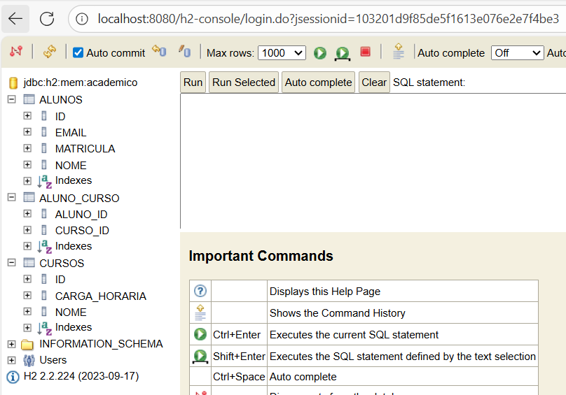
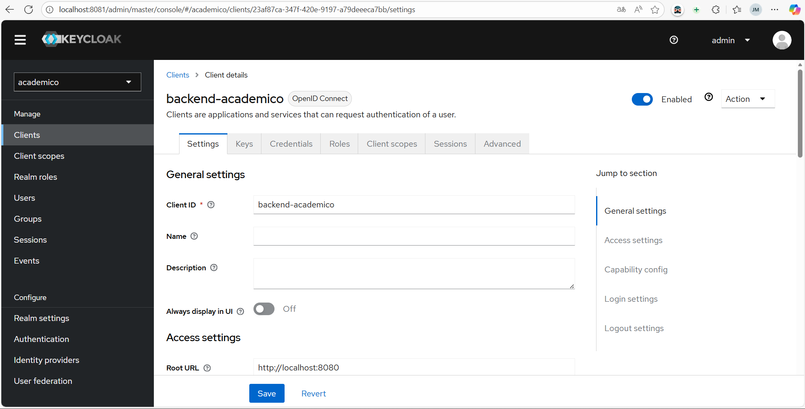
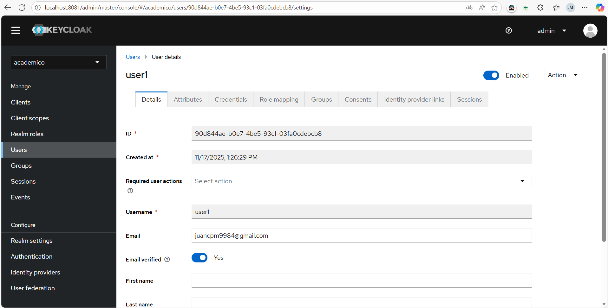
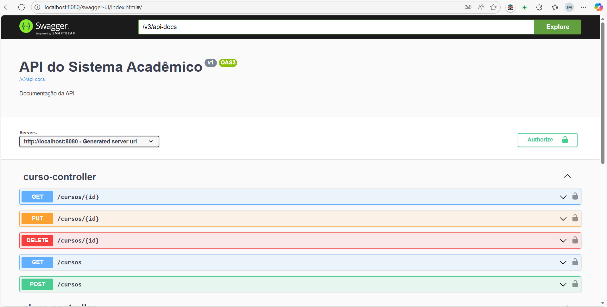
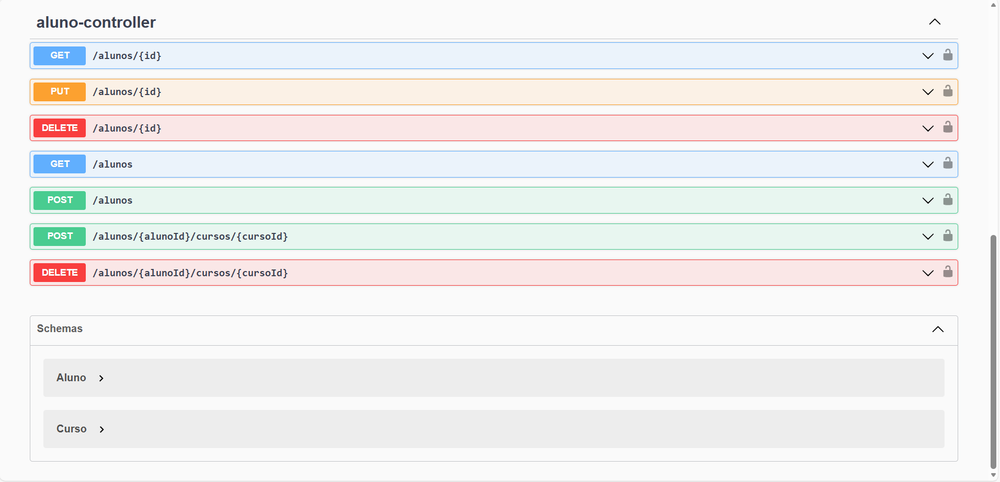
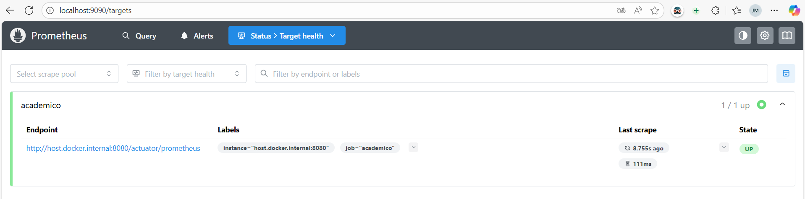
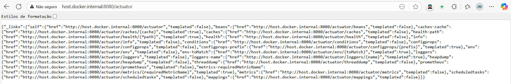
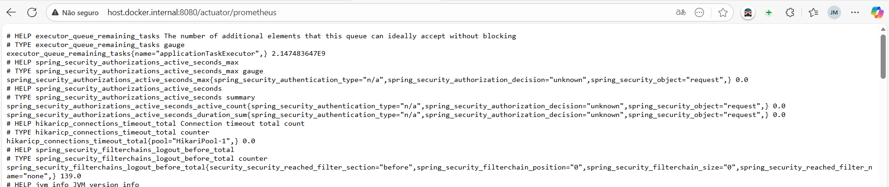
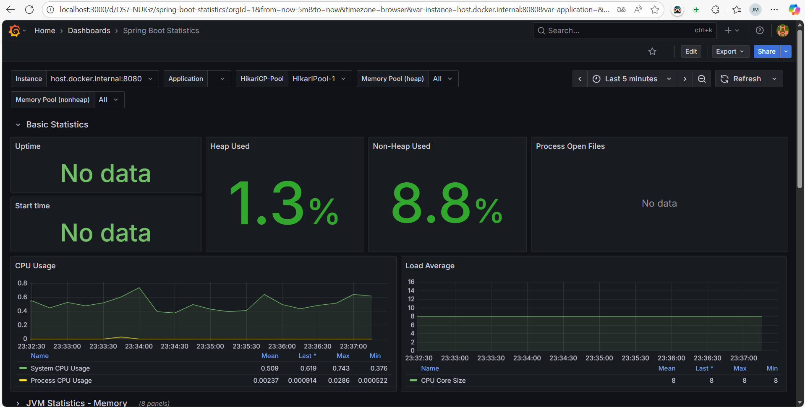
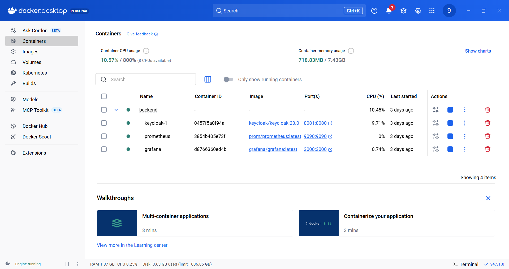

# 🎓 Sistema Acadêmico – Backend
Aplicação backend desenvolvida em **Spring Boot 3**, seguindo todos os requisitos da **Prática Avaliativa 2 (AV2)**, incluindo segurança, monitoramento, documentação, testes de carga e deploy.

---

# 📌 Tecnologias Utilizadas

- **Java 17+**
- **Spring Boot 3**
- **Spring Web**
- **Spring Data JPA**
- **Spring Security**
- **Spring Boot Actuator**
- **Springdoc OpenAPI (Swagger)**
- **H2 Database**
- **Prometheus**
- **Grafana**
- **Gatling** (ou JMeter)
- **Maven**

---

# 📁 Estrutura do Projeto


---

# 🧩 Modelagem das Entidades

## **Aluno**
- id
- nome
- email
- matricula
- Relacionamento **N:N** com Curso

## **Curso**
- id
- nome
- cargaHoraria
- Relacionamento **N:N** com Aluno

## **AlunoCurso**
- Entidade/tabela intermediária para relacionamento **N:N**

---
# ▶️ Como rodar o projeto localmente

### Pré-requisitos:
- Java 17+
- Maven 3.8+
- Git

### Passos:
```bash
git clone <URL_DO_REPOSITORIO>
cd backend
mvn spring-boot:run
```

---
# 🗄 Banco de Dados H2

A aplicação utiliza banco em memória.

Acesse o console:

📍 http://localhost:8080/h2-console

Configuração padrão:

JDBC URL: jdbc:h2:mem:academico

User: sa

Password: (vazio)



---

# 🔐 Autenticação – Spring Security

A aplicação possui autenticação configurada utilizando Spring Security.

Também é possível utilizar:

- Autenticação em memória
- Integração com Keycloak (sugerido pela prática)

User: admin
Password: admin



---

# 📄 Documentação da API — Swagger

O projeto possui documentação automática via Springdoc.

Acesse:

📘 Swagger UI:
---

http://localhost:8080/swagger-ui/index.html




📘 OpenAPI JSON:
---

http://localhost:8080/v3/api-docs

---

# 📡 Monitoramento — Actuator + Prometheus + Grafana

✔️ Actuator habilitado em:
---

/actuator
/actuator/health
/actuator/prometheus

✔️ Configurações no application.properties:
---

management.endpoints.web.exposure.include=health,info,prometheus
management.endpoint.prometheus.enabled=true

✔️ Prometheus:
---




✔️ Grafana:
---



---

# 📦 Docker – Prometheus e Grafana

Este backend possui monitoramento via Docker usando Prometheus e Grafana.

docker-compose.yml

- Rodar os serviços:

docker compose up -d

Prometheus → http://localhost:9090

Grafana → http://localhost:3000



---

# 🚀 Testes com Gatling
Instalação:

https://gatling.io/docs/gatling/reference/current/

- Estrutura:    /backend/src/test/gatling

- Execução: mvn gatling:test

- Relatórios: /target/gatling/<nome-do-teste>/

---

# 🚀 Testes com JMeter
Baixar JMeter:

https://jmeter.apache.org/

Rodar plano:
jmeter -n -t teste.jmx -l resultados.csv -e -o report

---

# ☁️ Deploy — Render
Documentação oficial:

https://render.com/docs/deploy-spring

Passos:

Subir o projeto no GitHub

Render → New Web Service

Conectar ao repositório

Build command:

mvn package -DskipTests


Start command:

java -jar target/<arquivo>.jar


Usar:

Java 17

Porta automática $PORT

---

# 📚 Referências

Spring Boot: https://docs.spring.io/spring-boot/docs/current/reference/html

Spring Data JPA: https://docs.spring.io/spring-data/jpa/docs/current/reference/html

Spring Security: https://docs.spring.io/spring-security/reference

Swagger (Springdoc): https://springdoc.org

Prometheus: https://prometheus.io

Grafana: https://grafana.com

Gatling: https://gatling.io

JMeter: https://jmeter.apache.org

---

# ✨ Autor & Contato

Desenvolvido por **Juan Carlos Pereira Matto**.

🌐 GitHub: https://github.com/JuanMatto/AV2

📦 Repositório do Projeto: https://github.com/JuanMatto/AV2  

---
